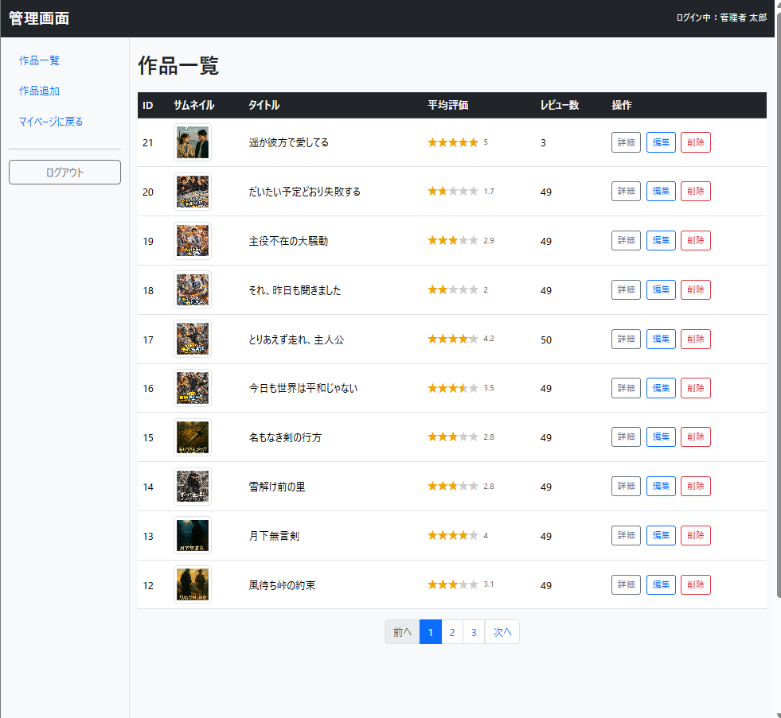
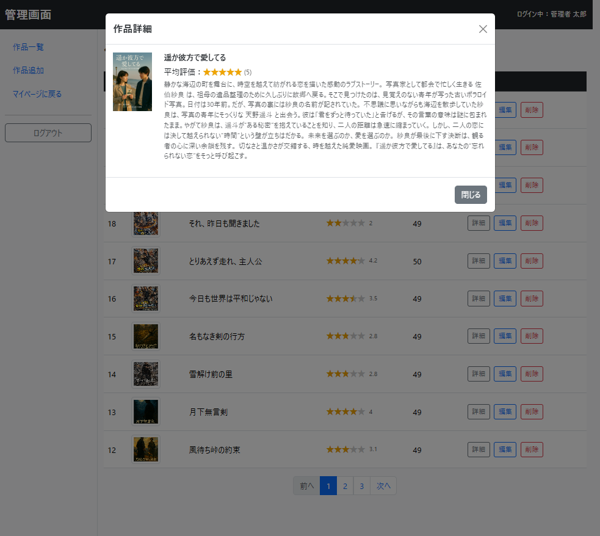
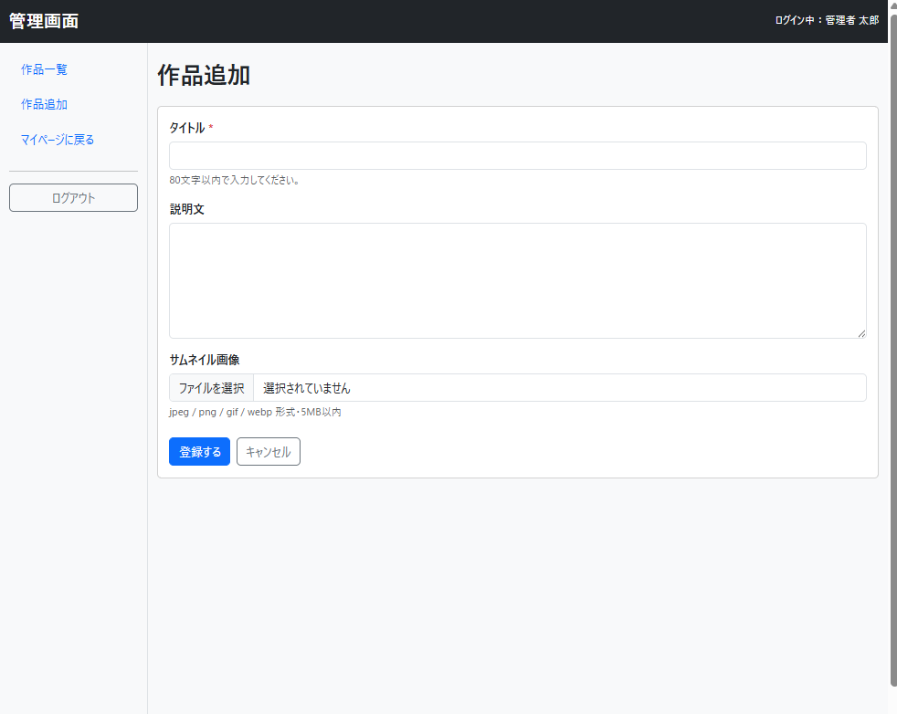
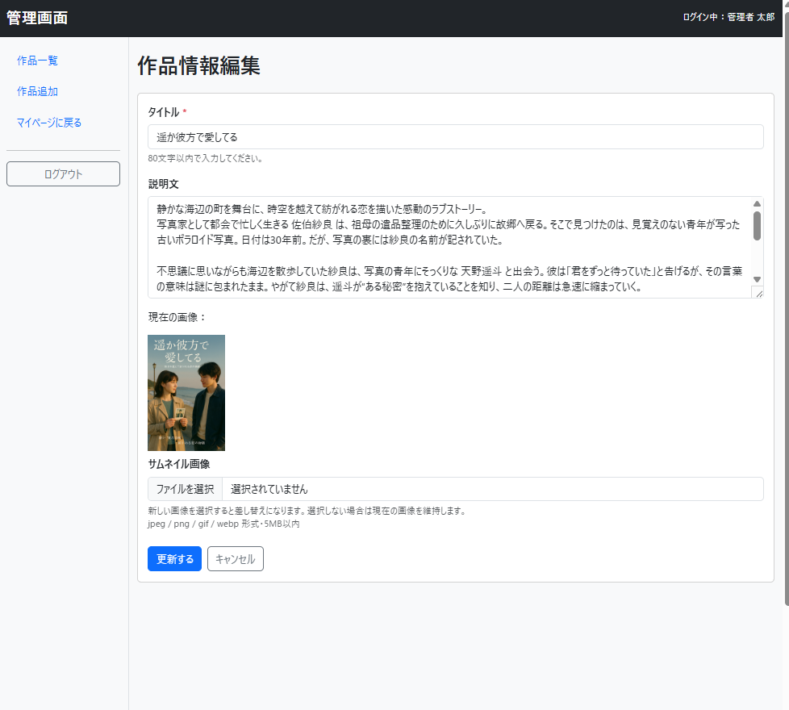
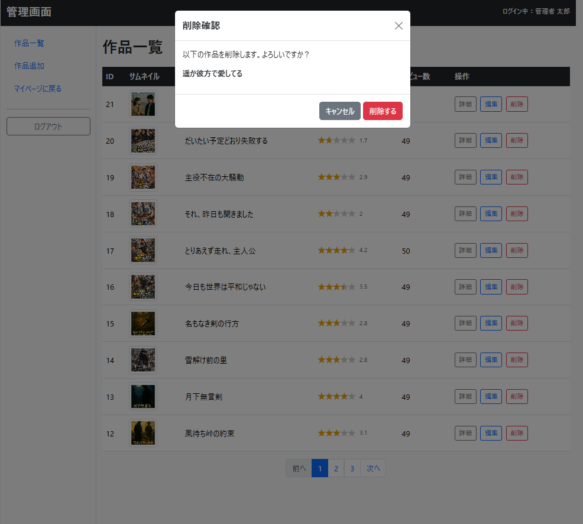
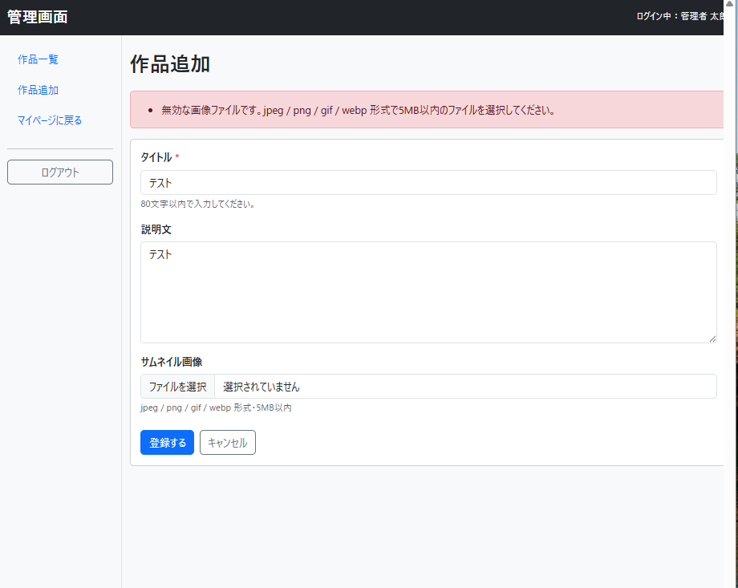

# Movie Review App

映画レビュー投稿アプリケーションです。
「観る前の判断材料」「観た後の共感」を提供することを目的としています。

職業訓練校の開発演習成果物をベースに、公開を想定してリファクタリングおよびセキュリティ対策を実施しました。
v1.1.0 では管理者機能（作品CRUD）を新規実装し、実運用を想定した構成へ拡張しています。

---

## 本番環境
https://portfolio.honda-dev.com/

> ※ 管理者機能はデータ保全およびセキュリティの観点から、一般公開していません。
> 実装内容はソースコードおよび本README内のスクリーンショットでご確認ください。
>
> ※ デモアカウントは公開していません。動作確認時は新規会員登録からご利用ください。

---

## 使用技術

### 本番環境
- PHP 8.4
- MariaDB / MySQL
- JavaScript / HTML / CSS
- Bootstrap 5.3
- XServer

### 開発環境
- Docker / Docker Compose（LAMP構成）
- MySQL 8.4
- Git / GitHub
- VSCode（WSL Remote）
- php-cs-fixer（コードスタイル統一）

---

## 主な機能

### ユーザー機能
- 会員登録 / ログイン / ログアウト
- プロフィール編集 / アカウント削除
- レビュー投稿 / 編集 / 削除（1作品1レビュー）
- レビュー返信機能（投稿・表示・編集・削除）
- 評価（レーティング）機能
- ページネーション

### 管理者機能（v1.1.0で追加）
- 作品一覧表示（ページネーション・平均評価表示）
- 作品詳細（モーダル表示）
- 作品登録（画像アップロード）
- 作品編集（既存画像差し替え対応）
- 作品削除（確認モーダル付き）

---

## 画面イメージ

### ユーザー画面

#### 作品一覧


#### 作品詳細


#### マイページ


### 管理者画面

> 管理者アカウントの認証情報は、データ保全およびセキュリティの観点から公開していません。
> 実装内容は本リポジトリのソースコード、および以下のスクリーンショットでご確認ください。

#### 作品一覧


#### 作品詳細（モーダル）


#### 作品追加


#### 作品編集


#### 作品削除（確認モーダル）


#### バリデーションエラー


---

## ER図


`users` / `items` / `reviews` を中心とした正規化設計。
外部キー制約によりデータ整合性を担保しています。
`review_replies` はレビュー返信機能で使用しており、各返信はレビューIDとユーザーIDに紐づけて管理しています。

---

## 設計方針

### アーキテクチャ
Laravel風のMVC構成をスクラッチで実装。
責務分離を意識し、フレームワーク移行時にも知識が活きる構成を目指しました。

```
admin/
├── controller/   … リクエスト制御・例外処理
├── model/        … DB操作（PDO）
├── view/         … 表示専用
├── validator/
│   └── rules/    … 単項目バリデーション（required / max_length / image など）
├── guards/       … 認証・認可（admin_guard / member_guard など）
├── lang/         … メッセージ定義（多言語化を見据えた構成）
└── bootstrap.php … 初期化・例外ハンドラ登録
```

### 設計上のこだわり
- **GETアクションは try/catch を書かない**：表示処理の失敗は復旧不能なため、`set_exception_handler` 経由で500画面へ集約
- **POSTアクションのみ catch**：想定可能・回復可能な例外のみ個別ハンドリング
- **PRGパターン採用**：二重送信防止
- **責務単位のコミット**：横断的関心事（CSRF・バリデーション）と機能（画面）を分離してコミット
- **メッセージの一元管理**：`lang/messages.php` に集約、動的値は呼び出し側で `sprintf()`

---

## セキュリティ対策

| 対策 | 実装内容 |
|------|---------|
| CSRF対策 | 全POSTでトークン検証 |
| XSS対策 | 出力時 `htmlspecialchars` 徹底、JS側は `innerHTML` 不使用 |
| SQLインジェクション対策 | PDOプリペアドステートメント |
| 認証 | `password_hash` / `password_verify`（bcrypt） |
| セッション固定攻撃対策 | ログイン成功時に `session_regenerate_id` |
| 認可制御 | guards によるロール別アクセス制御（未ログイン / 一般 / 管理者） |
| 画像アップロード | MIME検証 + 拡張子検証、5MB上限、孤児ファイル対策 |
| ファイル削除 | DB削除をCOMMIT後にファイル削除し、DBとファイルの不整合を最小化 |
| エラー画面 | 本番では詳細非表示、500.php へ集約 |
| 不正パラメータ | 型チェック + 存在チェック + 適切なリダイレクト |
| 不正アクセス対策 | `.htaccess` による探索系アクセスの遮断、アクセスログ解析の継続 |

---

## 技術的な工夫

- スクラッチMVCによる責務分離の実践
- バリデーションルールの単項目分離（再利用可能な設計）
- 例外ハンドラによる統一エラー制御
- 画像アップロードのトランザクション境界設計（DB→ファイル順、ロールバック考慮）
- ディレクトリ書き込み権限の事前チェック（`move_uploaded_file()` 失敗の早期検知）
- Docker開発環境の構築（WSL2上のLAMP）

---

## テスト

### 手動テスト
管理者機能について、以下の観点で手動テストを実施しました。

- 権限制御（未ログイン / 一般ユーザーは管理画面アクセス不可）
- 一覧表示・ページネーション
- 作品追加（正常系 / バリデーションエラー / 画像アップロード失敗）
- 作品編集（既存画像維持 / 差し替え / 入力なし更新）
- 作品削除（確認モーダル / DB・ファイル整合性）
- バリデーションエラー（入力保持・メッセージ表示）
- 例外・エラー系（500画面遷移）

### 今後の予定
PHPUnit を導入し、バリデーションルールおよび管理者機能の単体テストを追加予定です。

---

## 公開ポリシー

- 機密情報（`env.php` / `database.php`）は `.gitignore` で除外
- 公開用は `*.example.php` のみ
- 管理者アカウントの認証情報は非公開
- 実運用を想定したログ管理・アクセス制御を実装

---

## 今後の課題

- レビュー管理 / ユーザー管理の管理者画面追加
- 共通バリデーションと画面固有バリデーションの分離（`/lib/validation/` と `/app/validators/`）
- カテゴリー機能の実装
- PHPUnit による自動テスト導入
- フロントエンドバリデーションの追加
- Laravelへの段階的移行

---

## 更新履歴

### v1.1.0 - 管理者機能追加
- feat(admin): 作品CRUD実装（一覧・詳細・追加・編集・削除）
- feat(admin): バリデーター分離設計（validator/rules）導入
- feat(admin): 画像アップロードの孤児ファイル対策実装
- feat(admin): 削除確認モーダル / 詳細モーダル実装
- refactor: スクラッチMVCの責務整理（controller/model/view 分離）
- refactor: 例外ハンドリング方針統一（GET bubble up / POST catch）
- sec: 管理者ガード（admin_guard）追加
- chore: php-cs-fixer 導入（@PER-CS）
- docs: レビュー返信機能の記載漏れを補完（v1.0.0時点で実装済み）

### v1.0.0 - ユーザー機能リリース
- feat: 会員登録 / ログイン / プロフィール編集
- feat: レビューCRUD / レビュー返信機能 / レーティング / ページネーション
- sec: CSRF / XSS / SQLi / セッション固定攻撃対策
- docs: README整備、ER図公開

---

## 関連リンク

- 技術記事（Docker開発環境構築）: https://qiita.com/honda-dev-jp/items/e1dda4d4b6eab8f95d8a
- Qiita: https://qiita.com/honda-dev-jp
- X（開発ログ・学習記録）: https://x.com/honda_dev
